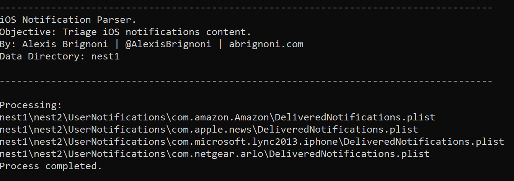

# iOS-Notifications-Parser
Python script that generates a HTML triage report of iOS notifications content.

Usage:   
python iOSNotificationsParser.py /path/to/data/directory . 

Requisites:  
1) Python 3 . 
2) The ccl_bplist module is required for the script to work. It can be found here: https://github.com/cclgroupltd/ccl-bplist (But a version has been inluded in this repo) . 
3) The included script.txt enables fields in the HTML report to be toggled between show and hide.  
4) The included NotificationParams.txt defines which values to be toggled between show and hide. Add more as needed one value per line.   

After process is completed a folder will be created in the same directory where the script is located. The folder will be named TriageReports_script_run_timestamp.
